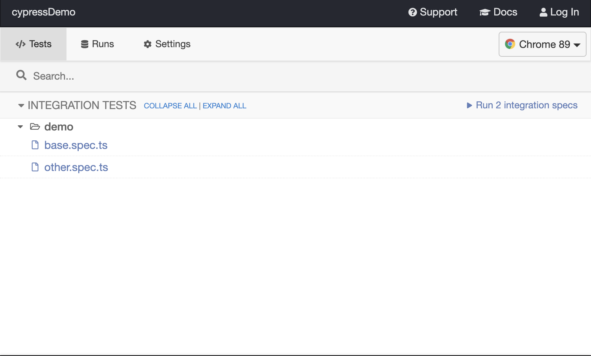
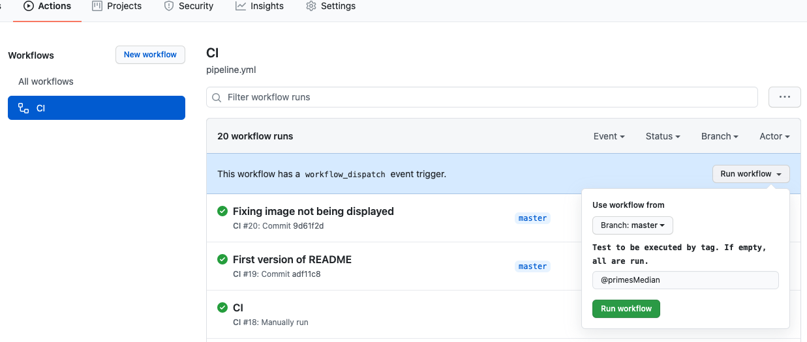
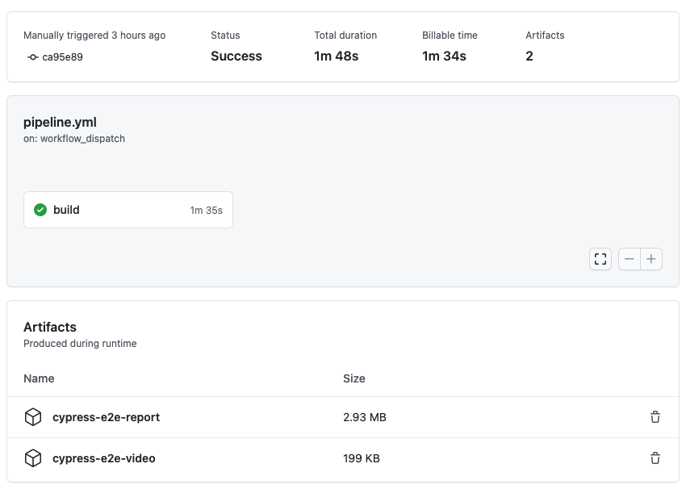

# E2E Demo Test

This repository is a demo about setting up the Cypress framework in order to run E2E tests against an hypothetical web application.

## Features
- Typescript friendly
- It uses Github actions as pipeline for continuous integration.
- Reports and recorded videos are saved as pipeline artifact allowing latter review.
- Separation between data, page structure and tests.
- Ability to target specific tests by tag.

## How can I quickly use this?
You can quickly start using this project after cloning this repo. Install all necessary dependencies:

```
yarn install
```

And execute the test!

```
yarn start
```


## ESLint
The official [ESLint plugin for Cypress](https://github.com/cypress-io/eslint-plugin-cypress) was installed to enforce [some of the best practices recommended for using Cypress](https://on.cypress.io/best-practices).

## Env Variables

At this moment, the only env variable require is `tags`. This variable allows filtering a subset of tests that match with the provided tag.

The project has defined internally another env variable, `baseUrl`, which is currently hardcoded. It is used to define the root url path for the tests executed.

`baseUrl` value is set in `~/cypress.json`.


## Tags

As an example, to set up a tag locally, from your bash terminal run the following:

```
export tag='@mytag'
```

This will set the `tag` env variable value to `@mytag`. Next time that you execute the test suite, it will use this env variable.

If this env variable is not set or it is set to emtpy `''`, then all tests will be run. In case the tag exists, only those tests tagged with it will run. Otherwise, if a non valid tag is specified, none of the tests will be executed.

In this project, these are the available tags:

| tag | spec file |
|---|---|
| `@primesMedian` | cypress/integration/demo/base.spec.ts |
| `@toronto` | cypress/integration/demo/other.spec.ts |

Please, be aware that the env variable "lives" only in the bash session where it was declared, until further assignment. In a new bash session, it will be empty/non-existent.

### How are tags being used

Each test file has a _wrapper_ method that allows defining tags:

```
filterTests(['@tag1'], () => {
  describe('Test scenario 1', () => {


  });
});
```

In this example, the _Test scenario 1_ test suite will be only executed when `@tag1` is the value of the `tag` env variable.

### Running tests with tags example

```
export tags='@toronto' && yarn start
```

### Multiple tags

It is possible to use multiple tags, despite it is out of scope for this demo. By doing:

```
export tags='@toronto,@montreal'
```

the test framework will only trigger those tests tagged with both `@toronto` and `@montreal` tags.

## Usage

- **Locally**
    Run `yarn start` to open the Cypress GUI and manually select a test to run.
    Run `yarn ci` to execute the tests headlessly.
- **Pipeline**
    Visit the [pipeline here](https://github.com/caragpe/cypressDemo/actions) to manually trigger a test execution

### Pipeline usage

Test execution can be trigger manually by accessing the pipeline and clicking on the blue `CI` button on the left and then on `Run workflow`.



We will be able to select the branch, and also to pass the tag(s) for filtering the tests. By default, `@primesMedian` is set.

If empty, remember that all test will be executed.

#### Execution results

By clicking on the different executions we can see the details of the test run, and access the reports:


## Reporting

Several reports are created in the folder `cypress/reports`:

- **XML reports**
This will create a (some) XML artifacts.
- **JSON reports**
Another format, depends on how are we going to consume this data.
- **HTML report**
For easy visualization. It will include screenshots of the errors (if any).


All these reports, and any video recordings, will be uploaded as artifacts when the tests are executed in the pipeline.
